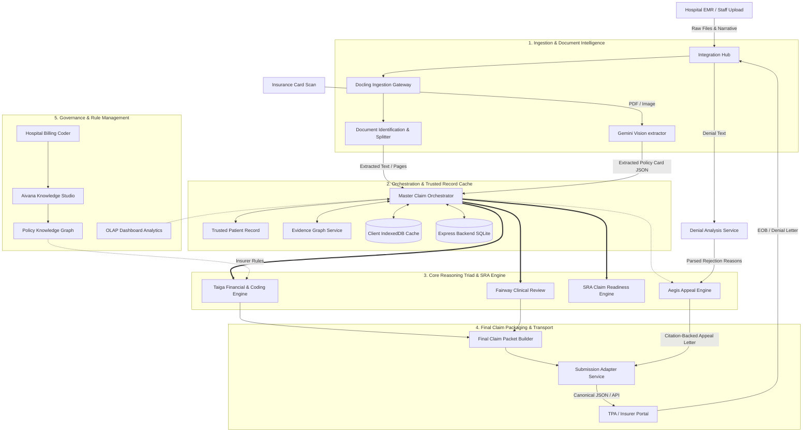
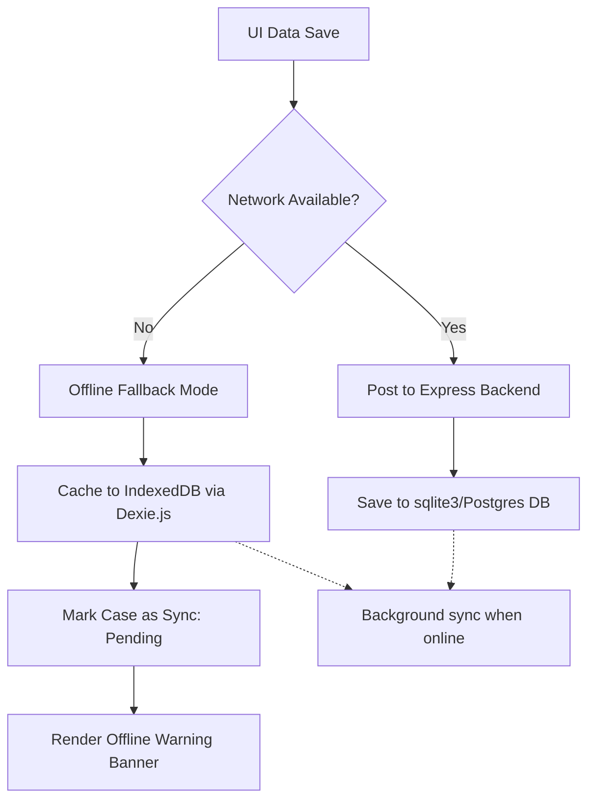

# Aivana Insurance OS — Comprehensive System Architecture Specification
### India TPA Insurance Copilot (Fairway Health + Aegis + Taiga)

This document is the master technical specification and operational reference manual for the **Aivana Insurance OS** platform. It details the architecture, module workflows, inputs/outputs, technical stacks, internal processing algorithms, mathematical formulations, and error-handling mechanisms for every core service layer.

---

## 1. System Vision & Architecture Diagram

Aivana Insurance OS is an autonomous revenue cycle management platform tailored for the Indian healthcare ecosystem. It operates as an intelligent middleware connecting hospital electronic medical records (EMRs), clinical notes, and billing systems with private insurers, Third-Party Administrators (TPAs), and the government's National Health Authority (NHA PM-JAY).

### 1.1. Core Design Principles
1.  **Deterministic-First Execution**: Pre-auth rules, PM-JAY package rates, co-pays, room rent limits, and ICD chapter locks are evaluated via strict deterministic code. LLMs are used only for narrative extraction and semantic validation.
2.  **Zero-Hallucination Appeal Synthesis**: Aegis is restricted to citing ONLY clinical evidence verified as present in the case history, preventing the fabrication of medical facts.
3.  **Local Offline Resilience**: Terminal endpoints in hospital wards cache data using client-side IndexedDB when the local Express server is unreachable, ensuring uninterrupted intake operations.

### 1.2. Complete System Architecture Map

---

## 2. Comprehensive Module Breakdown & Internal Processing

For each module, we outline its purpose, inputs/outputs, components, interactions, and the step-by-step algorithms it executes.

### 2.1. Ingestion & Document Intelligence Module
*   **Purpose**: Processes digital and scanned patient records, splits multi-page documents, and extracts structured patient profiles and policy cards.
*   **Inputs**: PDF or image byte arrays (admission notes, diagnostic scans, lab charts, health cards).
*   **Outputs**:
    *   `ExtractedPatientData`: JSON structured fields containing patient name, age, diagnoses lists, and vitals.
    *   `InsuranceCardExtracted`: JSON containing insurer name, TPA, policy number, sum insured.
*   **Key Components**:
    *   *Docling Ingestion Gateway*: Extracts raw characters and coordinates.
    *   *Document Identification Service*: Splits composite PDFs into document categories (discharge notes, lab reports).
    *   *Patient Information Extraction (PIE)*: Gemini-based LLM extractor for card fields.
*   **Module Interactions**: Ingests files from the hospital edge and pushes the structured text payload to the `Master Claim Orchestrator (MCO)`.
*   **Technologies & Versions**: `pdfjs-dist` (v6.1.200), `@google/genai` (v1.19.0), `gemini-2.5-flash` or `gemini-3.5-flash`.
*   **Internal Processing steps**:
    1.  The PDF/Image `ArrayBuffer` is received.
    2.  `pdfjsLib.getDocument()` attempts to extract text coordinates page-by-page.
    3.  If text is extracted, it formats pages with page markers: `--- START OF PAGE X ---`.
    4.  If the PDF is a scan (no text extracted), it encodes the pages to base64 and invokes the Gemini Multimodal Vision API (`MODEL_DOCUMENT`) to run OCR transcription.
    5.  The consolidated text is sent to the LLM extractor using a JSON-Schema mapping to extract demographic, insurance policy, and clinical vitals datasets.
    6.  Computes `missing_fields` and maps extracted snippets to their source pages in the `sourceTraceability` log.

---

### 2.2. Fairway Health (Clinical Evidence Review)
*   **Purpose**: Validates whether the patient's clinical note contains documented evidence of medical necessity to justify admission, ICU care, or procedure.
*   **Inputs**: `Trusted Patient Record` text, stated diagnosis, and admission type (planned/emergency).
*   **Outputs**: `EvidenceReviewReport` containing:
    *   `status`: `'sufficient' | 'pending_documents'`
    *   `requiredEvidence`: Verified clinical anchors.
    *   `insufficientEvidence`: Gaps in medical necessity.
    *   `reasoningTrace`: Step-by-step clinical justification log.
*   **Key Components**:
    *   *Evidence Checklist Engine*: Performs deterministic keyword scanning for vital and lab indicators.
    *   *LLM Reasoning Gateway*: Resolves semantic matches and checks complex synonyms (e.g. "thrombocytopenia" matching "platelet count").
    *   *Daycare Audit Engine*: Skips stay extension review and flags daycare-exempt cases if the patient's stay is under **24 hours**.
*   **Module Interactions**: Invoked by the `MCO` to produce the clinical readiness assessment.
*   **Technologies Used**: `llmClient` (MedGemma 4B / Qwen / Gemini 3.5 Flash), `utils/clinicalTextMatch.ts`.
*   **Internal Processing steps**:
    1.  Assembles the raw clinical narrative by joining chief complaints, history of present illness (HPI), findings, and progress notes.
    2.  Runs `runFairwayPreCheck()` to detect emergency status, active complications, or required labs.
    3.  Determines the medical specialty rules based on the primary diagnosis (e.g., Cardiology, Oncology, Urology).
    4.  Appends specialty-specific anchors and clinical guidelines to the review checklist:
        *   *Cardiology*: scans for ECG, Echocardiogram, Angiography, or BNP level.
        *   *Oncology*: scans for biopsy, histopathology reports, and chemo plan sheets.
        *   *Urology*: scans for post-void residual volume (PVR), stone size, or IPSS score.
        *   *Nephrology*: scans for serial creatinine levels and eGFR.
        *   *Pulmonology*: scans for SpO2, ABG, or peak expiratory flow rate (PEFR).
    5.  Queries the LLM for reasoning templates or runs the local `clinicalTextMatch()` on each checklist anchor against the narrative.
    6.  If an anchor is verified in the text (passing synonym overlap checks), it is marked as `present: true`. If not found, it is appended to `insufficientEvidence`.
    7.  Computes the clinical sufficiency status. If critical clinical anchors are missing, the status degrades to `'pending_documents'`.

---

### 2.3. Taiga Financial Engine
*   **Purpose**: Scrubs the billing ledger, calculates Room Rent limits, applies proportional deductions, caps implants, and checks ICD chapter locks.
*   **Inputs**: Requested bill amount, ward type, policy sum insured, requested room rent rate, clinical notes, and primary ICD-10 code.
*   **Outputs**: `BillingCodingOutput` containing approved cashless amount, patient share, deductions ledger, and coding warnings.
*   **Key Components**:
    *   *Room Rent Cap Engine*: Enforces 1% normal ward/2% ICU policy caps.
    *   *Proportional Deductions Calculator*: Applies IRDAI-compliant deductions.
    *   *Coding Scrubber*: Checks for surgical unbundling (CCI edits).
    *   *ICD Chapter Lock Engine*: Verifies code-category alignment.
*   **Module Interactions**: Takes output from `MCO` and feeds the scrubbed billing ledger into the `Final Claim Packet (FCP)`.
*   **Technologies Used**: `better-sqlite3`, `services/pmjayService.ts`, `services/policyConfigService.ts`.
*   **Internal Processing steps & Formulations**:
    1.  **AI Coding & Extraction**: Calls the LLM to map raw billing lines to CPT procedures and ICD-10 codes.
    2.  **CPT Mandatory Appending**: Scans the clinical note for procedures. If keywords like "CABG", "TKR", "LSCS", or "Cataract" are found, the corresponding CPT package code (e.g. 33533 for CABG) is injected if missing.
    3.  **Surgical Unbundling (CCI Edits)**: Runs deterministic regex matches on CPT combinations (e.g. laparotomy billed separately during laparoscopic cholecystectomy). If detected, it removes the unbundled item and flags a warning.
    4.  **Room Rent Capping & Proportional Deductions**:
        *   Standard policy caps:
            $$\text{Rent Cap Per Day} = \begin{cases} 
            \text{Sum Insured} \times 0.02 & \text{if Ward Type} = \text{ICU} \\
            \text{Sum Insured} \times 0.01 & \text{if Ward Type} = \text{Normal/Private}
            \end{cases}$$
        *   Package exemptions: Global packages (LSCS and Cataract daycare) are completely exempt from room rent caps & proportional deductions.
        *   If the requested rent exceeds the cap, it computes deductions. It subtracts non-associated fixed-rate charges (implants, medicines) from the requested amount first:
            $$\text{Associated Charges} = \text{Requested Amount} - (\text{Requested Rent} \times \text{Stay Days}) - \text{Implant Cost} - \text{Medicine Cost}$$
            $$\text{Proportional Deduction} = \text{Associated Charges} \times \left(1 - \frac{\text{Rent Cap Per Day}}{\text{Requested Rent}}\right)$$
            $$\text{Room Rent Deduction} = (\text{Requested Rent} - \text{Rent Cap Per Day}) \times \text{Stay Days}$$
            $$\text{GST Room Rent Surcharge} = \text{Room Rent Deduction} \times 0.05$$
    5.  **Implant Sub-limit Cap**: Orthopedic/cardiac implants are capped at ₹1,50,000. Excess is transferred to the patient's share.
    6.  **Senior Citizen Co-pay**: If the patient is $>60$ years and enrolled in a Senior or Red Carpet plan, a 20% co-pay is calculated:
        $$\text{Eligible Medical Charges} = \text{Requested Amount} - \text{NonMedicalDeductions} - \text{RoomRentDeduction} - \text{ProportionalDeduction} - \text{ExcessImplant} - \text{Exclusions} - \text{GST}$$
        $$\text{Copay Deduction} = \text{Eligible Medical Charges} \times 0.20$$
    7.  **Government PM-JAY Cap**: If the policy is a PM-JAY package, the cashless approved amount is capped at the NHA HBP standard package rate.
    8.  **Sum Insured Cap**: Approved cashless is capped at the policy Sum Insured limit.
    9.  **ICD Chapter Lock Check**: Verifies that the primary code maps to the diagnosis chapter (e.g. H codes for Cataract, O/Z for Maternity, M for Orthopedics). If it violates the lock, the code is overridden to `Pending ICD-10` and flagged for manual review.

---

### 2.4. SRA Claim Readiness Engine
*   **Purpose**: Computes the Submission Readiness Assessment (SRA) score (0-100) indicating if a claim file is ready for submission to the TPA.
*   **Inputs**: `PreAuthRecord` state and `EvidenceReviewReport` clinical audit.
*   **Outputs**: `ReadinessResult` containing the score, blocking gaps array, and missing items list.
*   **Module Interactions**: Controls the submission lock in the `InsuranceModule` UI workspace.
*   **Technologies Used**: `utils/readinessScore.ts`, `data/documentRequirements.ts`.
*   **Internal Processing steps & Scoring Algorithm**:
    1.  The engine checks if the diagnosis is mapped to standard guidelines. If no requirement mapping exists, it applies a major override deduction:
        $$\text{Deduction}_{\text{Unmapped}} = 60 \text{ points}$$
    2.  Evaluates data gaps. Each gap deducts **15 points** and appends to `blockingGaps`:
        *   Missing Patient Name.
        *   Missing Diagnosis.
        *   Invalid or Unconfirmed ICD-10 (e.g. `Pending ICD-10`).
        *   Missing Treating Doctor Registration Number.
        *   Missing Date of Admission.
        *   Surgical procedure listed with zero costs for Surgeon, OR, or Implants.
    3.  Evaluates document gaps. Compares uploaded document categories against the mandatory files required for the mapped ICD-10. Each missing file deducts **10 points**.
    4.  Evaluates clinical gaps. Adds a **10-point deduction** for every insufficient necessity item flagged in the `EvidenceReviewReport`.
    5.  Evaluates document warnings. Deducts **5 points** for each blurry document, expired policy, or duplicate file warning.
    6.  Calculates final SRA score:
        $$S_{\text{SRA}} = \max\left(0, \min\left(100, 100 - \sum \text{Deductions}\right)\right)$$
    7.  Sets status:
        *   $S_{\text{SRA}} \ge 80$: Highly Submittable.
        *   $50 \le S_{\text{SRA}} < 80$: Requires Action.
        *   $S_{\text{SRA}} < 50$: Critical Gaps (Submission blocked).

---

### 2.5. Aegis Appeal Engine
*   **Purpose**: Evaluates incoming TPA rejections or query letters and generates citation-backed appeal responses.
*   **Inputs**: `PreAuthRecord` details, raw denial letter text, and verified clinical FCP cache.
*   **Outputs**: `DenialAppealResult` containing the parsed reasons list, cited evidence, still missing items list, priority score, and the appeal text (in English and Hindi).
*   **Key Components**:
    *   *Denial Reason Parser*: Splits unstructured letters into individual rejection sentences.
    *   *Aegis Citation Gate*: Token-based evidence verification filter.
    *   *Priority Scorer*: Calculates case value and success metrics.
*   **Module Interactions**: Ingests rejections from the edge and dispatches the finalized appeal PDF to the `Submission Adapter`.
*   **Technologies Used**: `engine/denialAppealGenerator.ts`, `services/llmClient.ts`.
*   **Internal Processing steps**:
    1.  Splits the raw EOB letter into separate denial sentences.
    2.  For each denial sentence, it runs semantic matching against the verified FCP evidence.
    3.  Runs the **Aegis Citation Gate** to verify overlap. The evidence is accepted only if the cited text is at least 15 characters long (or matches an allowlisted medical acronym) and satisfies the token overlap ratio:
        $$\text{Token Overlap Ratio} = \frac{|\text{Tokens(Cited)} \cap \text{Tokens(FCP Evidence)}|}{|\text{Tokens(Cited)}|} \ge 0.40$$
    4.  If it passes the gate, it adds the evidence item to `citedEvidence` mapping back to its source document and page number.
    5.  If no matching evidence is found, it adds the item to `stillMissing`, creating a manual upload list for hospital staff rather than inventing a citation.
    6.  Estimates the Priority Score:
        $$\text{Priority Score} = \text{Claim Value} \times \left(\frac{\text{Addressed Reasons Count}}{\text{Total Rejection Reasons}}\right)$$
    7.  Queries the reasoning LLM to synthesize a medical-legal appeal letter. The prompt enforces that the LLM is restricted from writing any fact not present in the `citedEvidence` list.
    8.  Translates the letter to Hindi.

---

## 3. Local Offline Storage & Sync Mode

To handle flaky network connections in hospitals, the platform contains a robust local fallback mechanism:

*   **Dexie.js Implementation**: Active in `/services/masterPatientRecord.ts` and `components/InsuranceModule.tsx`.
*   **IndexedDB Cache**: Saves all clinical notes, intake forms, and pre-auth states locally in the browser when `net::ERR_CONNECTION_REFUSED` is caught.
*   **Reconciliation**: The UI displays an `[Offline Mode]` badge, and automatically syncs local files to the central SQLite database once connection status changes to online.
