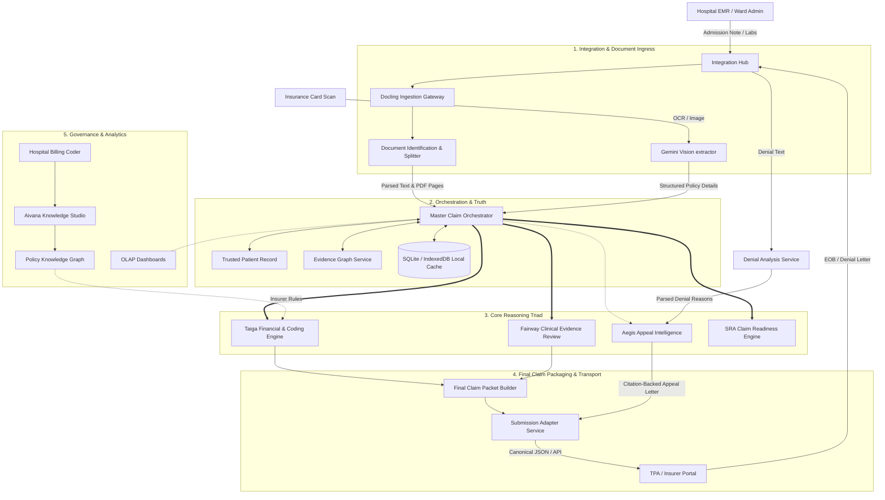

# Aivana Insurance OS — Architecture & Technical Reference Manual
### India TPA Insurance Copilot (Fairway Health + Aegis + Taiga)

This document is the definitive technical specification and system architecture reference manual for the **Aivana Insurance OS** platform. It provides a CTO-level architectural blueprint, detailing the end-to-end claim lifecycle, functional modules, mathematical formulations, data flows, and technical stack.

---

## 1. System Vision & Ingestion Pipelines

The **Aivana Insurance OS** is an autonomous revenue cycle management platform tailored specifically for the Indian healthcare market. It acts as an intelligent intermediary between hospital electronic medical records (EMRs), medical coders, and Insurance Third-Party Administrators (TPAs) or private insurers (e.g., Star Health, ICICI Lombard, HDFC Ergo) and the National Health Authority (NHA PM-JAY).

### 1.1. Core Design Philosophy
1. **Deterministic-First Execution**: Standard parameters, package rates, co-pays, room rent limits, and chapter locks are computed deterministically using structured algorithms. Large Language Models (LLMs) are used strictly for narrative extraction and semantic validation, eliminating hallucinations.
2. **Zero-Trust Clinical Verification**: Claims must match objective evidence (vitals, lab reports, imaging) present in the patient record. No claims or clinical events are fabricated.
3. **India-Specific Compliance**: Out-of-the-box support for IRDAI guidelines, room rent cap proportional deductions, surgical unbundling (CCI edits), and daycare exemptions.

---

## 2. Platform Architecture & End-to-End Workflows

### 2.1. System Architecture Map

The diagram below maps the ingestion, orchestration, reasoning, and analytics pipelines of the Aivana Insurance OS.



---

## 3. End-to-End System Workflow

1. **Intake Ingress**: The patient self-registers via QR or the ward admin uploads documents (admission notes, clinical history, diagnostic PDFs, and the insurance card).
2. **Identification & Splitting**: The `Docling Ingestion Gateway` reads documents via `pdfjs-dist`. The `Document Identification Service` parses them and splits them into distinct logical categories (e.g., separating a discharge summary from hematology reports).
3. **Consolidation**: The `Trusted Patient Record (TPR)` resolves demographic fields and extracts insurance card details (Sum Insured, TPA Name, Policy Number) using Gemini Vision.
4. **Clinical Evidence Validation (Fairway Health)**: Fairway evaluates the notes against clinical guidelines. If a Dengue pre-auth is filed, it scans for severe thrombocytopenia (platelet count $< 50,000/\mu\text{L}$) or vitals collapse to validate inpatient necessity.
5. **Financial & Code Compliance (Taiga)**:
    * Enforces ICD chapter locks based on diagnosis keywords.
    * Checks for unbundling (CCI edits).
    * Calculates room rent caps (1% normal ward, 2% ICU) and applies proportional deductions to associated charges.
    * Caps implants (₹1,50,000 orthopedic/cardiac limit).
    * Evaluates package limits (PM-JAY HBP or private package caps).
6. **Readiness Evaluation**: The `Claim Readiness Engine` runs the **Submission Readiness Assessment (SRA)** algorithm, deducting points for data gaps, missing required diagnostic files, or ungrounded clinical queries, producing a score from 0 to 100.
7. **Packaging & Ingress**: Once the case reaches a submittable score ($\ge 80\%$), the `Final Claim Packet Builder` creates a signed canonical JSON payload containing all clinical extract structures, billing ledger items, and PDF byte arrays. The `Submission Adapter Service` dispatches it to the TPA portal.
8. **Denial & Appeal (Aegis)**: If a claim is queried or denied, the `Denial Analysis Service (DAS)` ingests the EOB. The `Aegis Appeal Engine` verifies the denial reasons against FCP verified evidence using a token-overlap citation gate. If the facts exist, Aegis drafts a medical-legal appeal letter in English and Hindi. If evidence is missing, it adds them to a manual RFI checklist.

---

## 4. Detailed Module Breakdowns

### 4.1. Ingestion & Document Intelligence Module
*   **Purpose**: To ingest physical and digital patient files, identify their document categories, and extract structured demographic/policy metrics.
*   **Inputs**: PDF/Image byte arrays (lab reports, discharge summaries, clinical notes, insurance cards).
*   **Outputs**:
    *   `ExtractedPatientData`: JSON containing parsed patient name, age, diagnoses lists, vitals, and history.
    *   `InsuranceCardExtracted`: Insurer name, policy number, sum insured, cardholder name.
*   **Key Components**:
    *   *Docling Ingestion Gateway*: Extracts raw characters and maps text coordinates.
    *   *Document Identification Service*: Splits multi-page PDFs based on keyword vectors.
    *   *Patient Information Extraction (PIE)*: AI prompt extractor that parses card text and clinical lists.
*   **How it interacts**: Directly feeds the extracted text payloads into the `Master Claim Orchestrator`.
*   **Technologies Used**: `pdfjs-dist` (v6.1), Gemini Vision (`gemini-1.5-flash` or `gemini-2.5-flash`), `FileReader` base64 codecs.

### 4.2. Fairway Health (Clinical Evidence Review)
*   **Purpose**: To verify whether the clinical record contains documented evidence of medical necessity justifying the admission and proposed treatment.
*   **Inputs**: `Trusted Patient Record` text, stated primary diagnosis, and admission type.
*   **Outputs**: `EvidenceReviewReport` containing:
    *   `status`: `'sufficient' | 'pending_documents'`
    *   `requiredEvidence`: Verified clinical anchors (e.g. "NS1 Antigen positive").
    *   `insufficientEvidence`: Narrative gaps (e.g. "No platelet count documented for dengue pre-auth").
    *   `reasoningTrace`: Step-by-step logic detailing how necessity was evaluated.
*   **Key Components**:
    *   *Evidence Checklist Engine*: Performs deterministic keyword scans (e.g. checking for "platelets" and numbers).
    *   *LLM Reasoning Gateway*: Resolves semantic matches when complex synonym mapping is required.
    *   *Daycare Audit Engine*: Skips stay extensions and flags daycare-exempt cases if stay is under **24 hours**.
*   **Technologies Used**: `llmClient` (MedGemma 4B / Qwen Reasoning / Gemini 3.5 Flash), `clinicalTextMatch` utility.

### 5.3. Taiga Financial Compliance Engine
*   **Purpose**: To scrub the billing lines, calculate Room Rent cap overrides, apply proportional deductions, audit surgical packages, and verify ICD chapter matches.
*   **Inputs**: Requested invoice amount, ward type, policy sum insured, requested room rent rate, clinical notes, primary ICD-10 code.
*   **Outputs**: `BillingCodingOutput` containing:
    *   `cashlessApproved`: Approved amount payable by the insurer.
    *   `patientShare`: Amount payable by the patient.
    *   `roomRentDeduction` & `proportionalDeduction`.
    *   `copayDeductions` & `nonMedicalDeduction`.
    *   `validationWarnings`: Detailed list of warnings (unbundling, caps exceeded).
*   **Key Components & Mathematical Formulations**:
    *   **Room Rent Cap Validator**:
        $$\text{Rent Cap Per Day} = \begin{cases} 
        \text{Sum Insured} \times 0.02 & \text{if Ward Type} = \text{ICU} \\
        \text{Sum Insured} \times 0.01 & \text{if Ward Type} = \text{Normal/Private}
        \end{cases}$$
    *   **Proportional Deductions Engine**: If requested room rent per day exceeds the cap, proportional deductions apply to all associated charges (nursing, diagnostics, ICU charges, doctor fees). Fixed-rate implants and medicines are exempt per IRDAI guidelines.
        $$\text{Associated Charges} = \text{Requested Amount} - (\text{Actual Rent Rate} \times \text{Stay Days}) - \text{Implant Cost} - \text{Medicine Cost}$$
        $$\text{Proportional Deduction} = \text{Associated Charges} \times \left(1 - \frac{\text{Rent Cap Per Day}}{\text{Requested Rent Rate}}\right)$$
        $$\text{Room Rent Deduction} = (\text{Requested Rent Rate} - \text{Rent Cap Per Day}) \times \text{Stay Days}$$
        $$\text{GST Surcharge} = \text{Room Rent Deduction} \times 0.05$$
    *   **Senior Citizen Co-pay Calculation**:
        $$\text{Eligible Medical Charges} = \text{Requested Amount} - \text{NonMedicalDeductions} - \text{RoomRentDeduction} - \text{ProportionalDeduction} - \text{ExcessImplant} - \text{Exclusions} - \text{GST}$$
        $$\text{Copay Deduction} = \text{Eligible Medical Charges} \times 0.20$$
        $$\text{Approved Cashless} = \text{Eligible Medical Charges} - \text{Copay Deduction}$$
    *   **ICD Chapter Locks**: Restricts ICD-10 prefixes based on clinical category:
        *   Ophthalmology $\rightarrow$ prefix `H`
        *   Maternity/LSCS $\rightarrow$ prefix `O` or `Z`
        *   Gynecology $\rightarrow$ prefix `D`, `N`, or `Z`
        *   Orthopedics $\rightarrow$ prefix `M`
    *   **Surgical Unbundling (CCI Edits)**: Rejects double billing of access procedures (e.g. Laparotomy billed alongside Laparoscopic Cholecystectomy).
*   **Technologies Used**: `better-sqlite3`, `pmjayService`, `policyConfigService`, `icdService`.

### 5.4. SRA Claim Readiness Engine
*   **Purpose**: To evaluate the overall completeness and audit health of a claim file before submission, providing an SRA score (0-100).
*   **Inputs**: `PreAuthRecord` state and `EvidenceReviewReport` clinical audit.
*   **Outputs**: `ReadinessResult` containing SRA score, missing items array, and submittability flag.
*   **SRA Scoring Formulation**:
    Starting with a base score of $S = 100$, deductions are applied sequentially:
    $$S = 100 - \sum \text{Deductions}$$
    
    | Category | Condition / Gap | Deduction |
    | :--- | :--- | :--- |
    | **Data Gaps** | Missing Patient Name | $-15$ points |
    | | Missing Stated Diagnosis | $-15$ points |
    | | Invalid/Unassigned/Low-confidence ICD-10 | $-15$ points |
    | | Missing Treating Doctor Registration | $-15$ points |
    | | Missing Date of Admission | $-15$ points |
    | | Surgical Case with zero Surgeon/OT fees | $-15$ points |
    | **Diagnostic Gaps** | Missing Required Diagnostic File (Per ICD-10 requirement map) | $-10$ points per file |
    | **Clinical Gaps** | Insufficient evidence items flagged by pre-audit | $-10$ points per gap |
    | **Document Warnings** | Blurry/Readability warning | $-5$ points per file |
    | | Expired Policy warning | $-5$ points per file |
    | | Duplicate Document warning | $-5$ points per file |
    | **Unmapped Case** | No document requirement mapping exists for diagnosis | $-60$ points |
*   **Submittability Thresholds**:
    *   $S \ge 80\%$: Highly Submittable.
    *   $50\% \le S < 80\%$: Requires Action.
    *   $S < 50\%$: Critical Gaps (Blocked from submission).
*   **Technologies Used**: `utils/readinessScore.ts`, `data/documentRequirements.ts`.

### 5.5. Aegis Appeal Engine
*   **Purpose**: To generate structured, citation-backed appeal letters when a claim is queried or denied.
*   **Inputs**: `PreAuthRecord`, parsed denial reasons, and FCP evidence cache.
*   **Outputs**: Appeal package draft, priority score, and Hindi translation.
*   **Key Components**:
    *   *Aegis Citation Gate*: Ensures facts are verified. A cited piece of evidence is passed only if the token overlap is $\ge 40\%$ or matches an allowlisted medical acronym:
        $$\text{Token Overlap Ratio} = \frac{|\text{Tokens(Cited)} \cap \text{Tokens(FCP Evidence)}|}{|\text{Tokens(Cited)}|} \ge 0.40$$
        *Allowlisted acronyms*: `hba1c`, `spo2`, `ecg`, `ct`, `mri`, `cbc`, `wbc`, `usg`, `cxr`, `aki`, `dka`.
    *   *Denial Reason Parser*: Splits multi-reason rejections into distinct audit queries.
    *   *Priority Scorer*: Evaluates case value and likelihood of success:
        $$\text{Priority Score} = \text{Claim Value} \times \left(\frac{\text{Addressed Reasons Count}}{\text{Total Denial Reasons}}\right)$$
*   **Technologies Used**: `engine/denialAppealGenerator.ts`, `services/llmClient.ts`.

### 5.6. Local Offline Sync Module
*   **Purpose**: Allows hospital ward terminals to operate seamlessly during network blackouts by caching data locally.
*   **Inputs**: Patient data state.
*   **Outputs**: Sync status flag, local database inserts.
*   **Key Components**:
    *   *Dexie.js ORM*: Abstracts IndexedDB operations.
    *   *Sync Service*: Periodically polls connection status and flushes local records to the Express backend database.
*   **Technologies Used**: Dexie.js (v4.4), SQLite database.

---

## 6. Technical Stack Mapping

The following table documents the technology mapping across the platform modules:

```
+-----------------------------------------------------------------------------+
|                               TECHNICAL STACK                               |
+-----------------------------------------------------------------------------+
| Frontend Core     | React 19, TypeScript 5.8, Vite 6.4                      |
| Storage Layer     | Dexie.js (IndexedDB Client), SQLite (better-sqlite3)    |
| Ingestion         | pdfjs-dist (OCR Extraction & Bounding Boxes)            |
| AI Gateway        | @google/genai, @google/generative-ai (v0.24)            |
| Automation QA     | Playwright 1.61 (End-to-End browser test suite)          |
+-----------------------------------------------------------------------------+
```

| Component / Layer | Technology | Version | Used by Module |
| :--- | :--- | :--- | :--- |
| **User Interface** | React | `19.1.1` | `InsuranceModule`, `PreAuthWizard`, `DenialHub` |
| **Language Compiler** | TypeScript | `~5.8.2` | Core codebase, types definition (`types.ts`) |
| **Build Pipeline** | Vite | `^6.4.1` | Dev Server orchestration, Hot Module Reloading |
| **Local Cache Store** | Dexie.js | `^4.4.4` | `masterPatientRecord`, offline IndexedDB fallback |
| **Central Database** | SQLite | `^12.11.1` | Express backend storage (`better-sqlite3`) |
| **API Endpoints Router** | Express | `^5.2.1` | Local backend endpoints server (`backend/server.ts`) |
| **AI LLM Gateway** | Google GenAI SDK | `^1.19.0` | `apiKeys.ts`, `llmClient.ts`, `geminiService.ts` |
| **Diagnostic PDF Reader** | PDF.js | `^6.1.200` | `documentExtractionService.ts` (Ophthalmology/Labs) |
| **End-to-End QA Runner** | Playwright | `^1.61.1` | Continuous test integration (`testBattery.ts`) |

---

## 7. Edge Cases & Error Handling

### 7.1. Gemini API Quota Exhaustion (429 / 500 Errors)
*   **Symptom**: Insurer / pre-auth extracts hit spending limits or rate caps (`RESOURCE_EXHAUSTED`).
*   **Resolution Strategy**:
    *   *Demo Bypass Gate*: The system checks `process.env.VITE_DEMO_MODE === 'true'`. If active, it intercepts the API requests in `geminiService.ts` and `llmClient.ts` and returns predefined clinical profiles (Dengue, Diabetes, Appendicitis).
    *   *Synchronous Clinical Check Fallback*: If the AI call in `clinicalTextMatch` fails, the engine degrades gracefully to the local string-synonym check (`clinicalTextMatchSync`) to ensure the pipeline does not throw 500 errors.

### 7.2. ICD Chapter Lock Violations
*   **Symptom**: Coders enter an invalid ICD code prefix for a procedure (e.g. assigning a maternity `O` code to an orthopedic knee replacement).
*   **Resolution Strategy**: The Taiga engine runs `enforceICDChapterLocks()`. If the prefix fails the validation array, the code is overridden to `Pending ICD-10` with a warning, blocking automatic pre-auth submission and routing the case to the manual review queue.

### 7.3. Zero-Cost Surgical Scenarios
*   **Symptom**: Pre-auth file indicates a surgical procedure but lists ₹0 for surgeons fees, anesthesia, or OR time.
*   **Resolution Strategy**: The SRA readiness checker flags this as a critical gap, deducting 15 points and locking the wizard to prevent submission of an incomplete billing ledger to the TPA.
