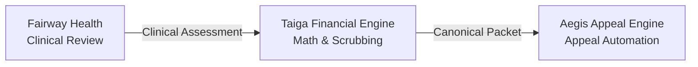
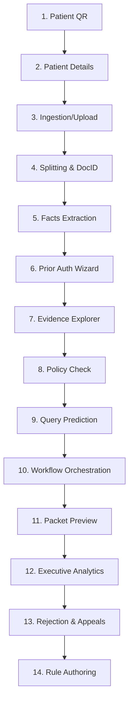
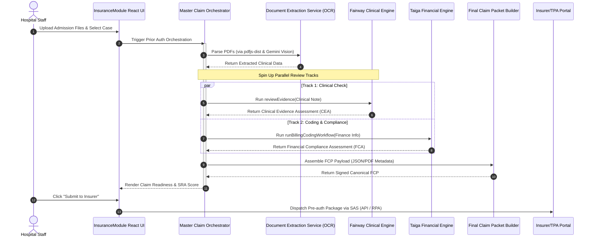
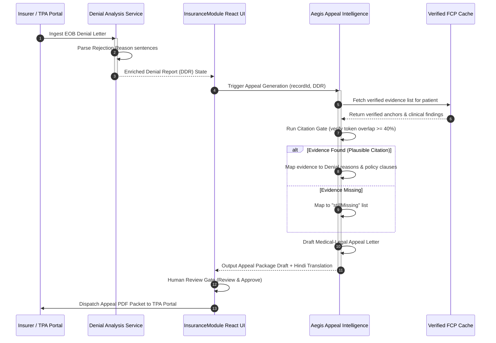
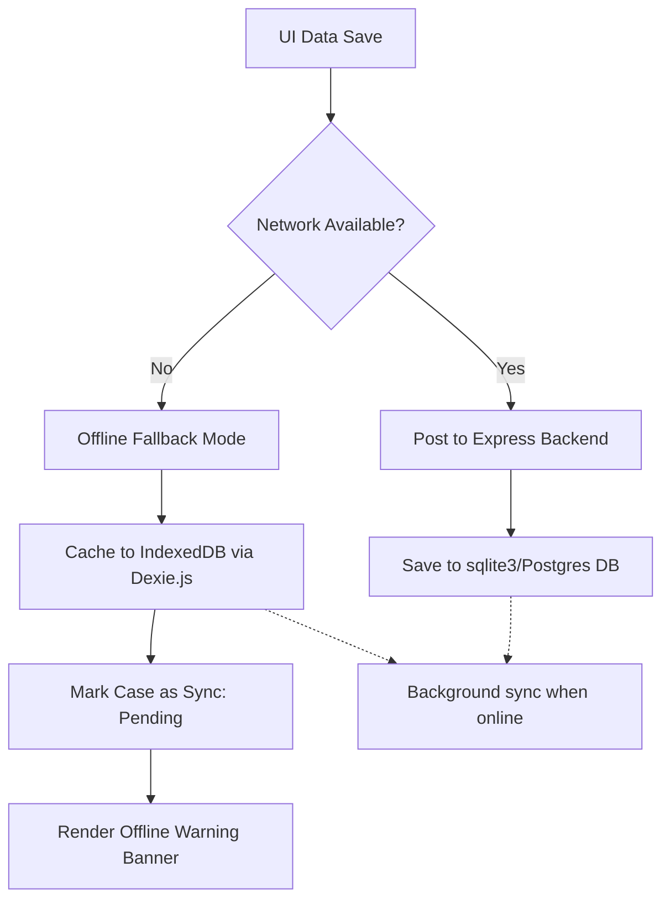

# Aivana Insurance OS — India TPA Insurance Copilot
### Technical Architecture & System Flow Specification (Fairway Health + Aegis + Taiga)

This document provides a production-grade, end-to-end architectural walkthrough of the **Aivana Insurance OS** platform. It details the system's vision, core tech stack, component interactions, and the operational flows of its three core clinical and financial intelligence layers: **Fairway Health**, **Taiga**, and **Aegis**.

---

## 1. System Vision & Architecture Principles

The **Aivana Insurance OS** is designed to build the *Autonomous Revenue Cycle for the Indian Healthcare ecosystem*. It automates prior authorization (pre-auth) requests, claims scrubbing, stay extensions, and denial appeals by checking clinical evidence against insurer policies and guidelines.

### Core Architecture Philosophy
*   **Deterministic First**: All structured checks, package rates, caps, and rules run on a fast, deterministic engine. Large Language Models (LLMs) are invoked only where narrative extraction, clinical translation, or semantic matching is required.
*   **Zero-Hallucination Appeals**: Aegis will never formulate claims or evidence. It only cites facts already extracted and verified as present in the case record.
*   **IRDAI & TPA Compliance**: Built-in adherence to Indian regulatory frameworks, including Room Rent Capping, Proportional Deductions, Daycare Package exemptions, and ICD Chapter Locks.

---

## 2. Core Technology Stack

The application is built as a multi-tier client-server workspace designed to support fully offline fallback operations in case of network outages.

| Technology Component | Technology Used | Description / Purpose |
| :--- | :--- | :--- |
| **Frontend Framework** | React 19 (TypeScript 5.8) | Component-driven UI rendering with strict type-safety. |
| **Build Tool & Server** | Vite 6.4.1 | Development server and asset bundler. |
| **Styling & UI Elements** | Vanilla CSS + Lucide Icons | Premium, scalable, and responsive interface layout. |
| **Local Client Storage** | Dexie.js (IndexedDB wrapper) | Stores local patient records and pre-auth states when the backend is unreachable. |
| **Backend Framework** | Express 5.2 | Serves patient databases and routes API payloads. |
| **Database Layer** | SQLite (via `better-sqlite3`) / Neon Postgres | SQLite is used for local database cache; Neon PostgreSQL client is set up for cloud deployments. |
| **Document Processing** | `pdfjs-dist` | Runs PDF parsing, image extraction, and text extraction. |
| **AI SDK & Models** | `@google/genai` (Gemini API) / MedGemma / Qwen | General reasoning and multimodal parsing route through Gemini API. Supports custom reasoning endpoints. |
| **Testing / Verification** | Playwright 1.61 | End-to-end system testing, script runners, and SLA metrics validation. |

---

## 3. The Triad of Intelligent Engines

The core value of Aivana is powered by three specialized reasoning layers working in unison:

### 3.1. Fairway Health Layer (Clinical Evidence Review)
Fairway evaluates the patient's medical necessity by comparing the clinical note/treatment charts against insurer guidelines.
*   **Medical Necessity Checks**: Evaluates disease profiles (Dengue, Typhoid, Cataract, LSCS) against clinical thresholds (e.g. Platelets < 50k for Dengue inpatient stays).
*   **Fact Verification**: Analyzes symptoms, vitals, diagnostics, and doctor descriptions.
*   **Exclusion/Daycare Audit**: Daycare/short stays under **24 hours** (e.g. 18-hour or 12-hour observations) are flagged as daycare-exempt, preventing unnecessary clinical query flags.

### 3.2. Taiga Layer (Financial Compliance & Coding)
Taiga enforces financial compliance and performs coding audits based on private insurers and Government PM-JAY package guidelines.
*   **Room Rent Capping**:
    *   *Normal Ward*: Capped at **1%** of the Policy Sum Insured per day.
    *   *ICU Ward*: Capped at **2%** of the Policy Sum Insured per day.
*   **Proportional Deductions**: If the actual room rent exceeds the policy cap, Taiga applies proportional deductions to all associated hospital charges (nursing, diagnostics, doctor fees) before calculating approved amounts. Implants and medicines are excluded from this deduction.
    $$\text{Proportional Deduction} = \text{Associated Charges} \times \left(1 - \frac{\text{Cap Per Day}}{\text{Requested Rent Per Day}}\right)$$
*   **Surgical Package Exemptions**: Global surgeries (like LSCS or Cataract Daycare) are exempt from room rent caps & proportional deductions.
*   **Implant Sub-limit Capping**: Cardiac or orthopedic implants are capped at ₹1,50,000, with excess transferred to the patient's share.
*   **Senior Citizen Co-pay**: Applies a 20% co-payment to approved medical charges if the patient is $> 60$ years and on a Senior/Red Carpet plan.
*   **ICD Chapter Locks**:
    *   *Ophthalmology / Cataract*: Restricts coding strictly to **H** codes.
    *   *Maternity / LSCS*: Restricts coding strictly to **O** or **Z** codes.
    *   *Gynecology / Hysterectomy*: Restricts coding strictly to **D**, **N**, or **Z** codes.
    *   *Orthopedics / TKR*: Restricts coding strictly to **M** codes.
    *   *Ambiguous Inputs*: Vague conditions map to a `Pending ICD-10` code requiring manual review.
*   **CCI Surgical Unbundling**: Detects invalid double-coding (e.g., billing laparotomy access separately during appendectomy).

### 3.3. Aegis Layer (Denial & Appeal Automation)
Aegis automates appeals when claims are queried or rejected by the TPA.
*   **Aegis Citation Gate**: Prevents hallucination by verifying that any cited evidence has at least 40% token overlap with the verified patient file.
*   **Still Missing Tracking**: If a denial reason cannot be matched with existing evidence, it flags the item as `stillMissing` to prompt the hospital staff rather than fabricating clinical facts.
*   **Appeal Letter Generation**: Generates a professional legal-medical appeal letter and translates it into Hindi.

---

## 4. End-to-End Claim Lifecycle (14-Screen Process Flow)

The platform workspace guides users through 14 distinct steps of a claim's lifecycle:

1.  **Patient QR Workflow (`PatientQRWorkflowView`)**: Self-registration via scanning patient QR codes to initialize a claim intake.
2.  **Patient Details (`PatientDetailsView`)**: Consolidates patient demographics, policy coverage limits, and TPA information.
3.  **Upload Ingestion (`UploadIngestionView`)**: Main document ingress point for physical records, lab charts, and discharge sheets.
4.  **Document Identification (`DocumentIdentificationView`)**: Uses `pdfjs-dist` to automatically identify and split multi-page documents (e.g., identifying lab reports vs. doctor prescriptions).
5.  **Extracted Information (`ExtractedInformationView`)**: Maps unstructured text to canonical patient records.
6.  **Claim Readiness (`ClaimReadinessView`)**: Displays the **SRA Readiness Score**. Integrates the *Prior Auth Wizard* to address clinical flags and gaps before submission.
7.  **Evidence Explorer (`EvidenceExplorerView`)**: Anchors clinical facts directly to page numbers and text blocks on the uploaded PDFs, providing physical proof.
8.  **Policy Validation (`PolicyValidationView`)**: Performs Taiga financial rule checks (room rent caps, unbundling, unlisted codes).
9.  **TPA Query Prediction (`TpaQueryPredictionView`)**: Estimates the probability of a TPA query or RFI (Request for Information) and shows recommended preemptive adjustments.
10. **Claim Workflow Timeline (`ClaimWorkflowTimelineView`)**: Renders the complete orchestration timeline and checks latency SLAs.
11. **Claim Packet Preview (`ClaimPacketPreviewView`)**: Compiles and displays the final canonical claim packet JSON/PDF ready for transport.
12. **Analytics (`AnalyticsView`)**: OLAP-style dashboard tracking hospital pre-auth approval rates, turnaround times, and outstanding claim values.
13. **Denial Queue (`DenialQueue`)**: Consolidates rejected pre-auths and triggers Aegis to formulate legal-medical appeal packages.
14. **Admin Policy Config (`AdminPolicyConfigView`)**: Admin control panel for rule authoring, modifying private insurer parameters, and mapping government PM-JAY packages.

---

## 5. Sequence Flows & Component Interactions

### 5.1. Prior Authorization Ingestion & Orchestration Flow

This sequence diagram illustrates how a pre-auth claim is uploaded, processed by the parallel engines, and assembled into a canonical FCP.

### 5.2. Denial Ingestion & Aegis Appeal Generation Flow

This flow illustrates the process that occurs when a TPA rejects a claim, triggering the Appeal Generation.

---

## 6. Local Offline Storage & Sync Mode

To handle flaky network connections in hospitals, the platform contains a robust local fallback mechanism:

*   **Dexie.js Implementation**: Active in `/services/masterPatientRecord.ts` and `components/InsuranceModule.tsx`.
*   **IndexedDB Cache**: Saves all clinical notes, intake forms, and pre-auth states locally in the browser when `net::ERR_CONNECTION_REFUSED` is caught.
*   **Reconciliation**: The UI displays an `[Offline Mode]` badge, and automatically syncs local files to the central SQLite database once connection status changes to online.
