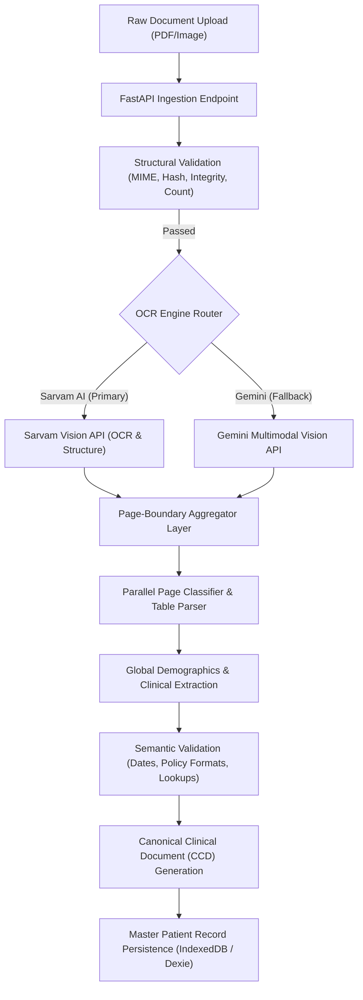

# Document Ingestion, OCR, and Classification Pipeline Guide

This guide describes Aivana's document processing pipeline, designed to ingest clinical documents, perform OCR character extraction, classify document pages, and validate the parsed data into a **Canonical Clinical Document (CCD)**.

---

## 1. Pipeline Architecture

The document ingestion gateway is built as a sequential flow consisting of structural validation, OCR extraction (using Sarvam AI or Google Gemini), page-level classification, global entity extraction, and semantic validation.



---

## 2. Ingestion Lifecycles & Processing States

Each document uploaded goes through several states to enable observability, status tracking, and error auditing:

*   `RECEIVED`: Raw file accepted by the endpoint, unique SHA-256 hash generated.
*   `VALIDATED`: Passed **Structural Validation** (integrity, format, and duplicate check).
*   `OCR_IN_PROGRESS`: Currently extracting characters and layout structures from files.
*   `OCR_COMPLETE`: Text characters and markdown tables successfully extracted.
*   `CLASSIFIED`: Page-by-page document category mapping (e.g., CBC Report, OPD Prescription) and table reconstruction completed.
*   `READY_FOR_EXTRACTION`: Global demographic and clinical entities extracted, validated against semantic constraints, and packaged into the final CCD.

---

## 3. Two-Layer Validation Specification

Aivana uses a strict two-layer validation strategy to prevent data contamination and ensure compliance:

### Layer 1: Structural Validation (Deterministic File Level)
*   **MIME-Type Audit**: Restricts ingestion strictly to approved types: `application/pdf`, `image/jpeg`, `image/png`.
*   **Duplicate Detection**: Compares SHA-256 hashes against existing patient documents in the database to prevent duplicate processing.
*   **Page Boundary Checks**: Verifies page integrity and page count limits (e.g., Sarvam's 10-page limit).

### Layer 2: Semantic Validation (Data Level Constraints)
*   **Institutional Registry Audit**: Validates insurer and TPA names against the hospital's registries.
*   **Chronological Date Audit**: Verifies that the date of admission is prior to or equal to the discharge date (`dateOfAdmission <= dischargeDate`).
*   **Regex Pattern Audits**: Validates UHID and Policy Numbers against insurer-specific regex expressions.

---

## 4. OCR & Digitisation Engines

Aivana implements a dual-engine OCR pipeline to ensure maximum accuracy and zero downtime:

### Primary: Sarvam AI (`sarvam-vision`)
*   **Purpose**: Optimized for complex multi-lingual Indian documents, handwritten prescriptions, and structural layout preservation (like tables and nested reports).
*   **Base URL**: `https://api.sarvam.ai`
*   **Required Header**: `api-subscription-key`
*   **Language Scope**: Supports English plus 22 official Indian languages.

### Fallback: Google Gemini (`gemini-1.5-pro` / `gemini-1.5-flash`)
*   **Purpose**: Activated automatically if Sarvam credentials are not configured, if the file exceeds Sarvam page bounds, or if the Sarvam service encounters rate limits (HTTP 429) or timeouts.

---

## 5. Integration Implementation

The environment variables must be configured with active API keys:

```bash
# .env / .env.local
VITE_SARVAM_API_KEY=sk_gzdv911q_oPRY2aIlnpL2KCFQB8EV7boF
SARVAM_API_KEY=sk_gzdv911q_oPRY2aIlnpL2KCFQB8EV7boF
```

The system will verify the presence of `SARVAM_API_KEY` on startup and seamlessly route scanned PDF and image extractions through the Sarvam Vision model, extracting structured layouts and converting tables directly into parsing nodes.
